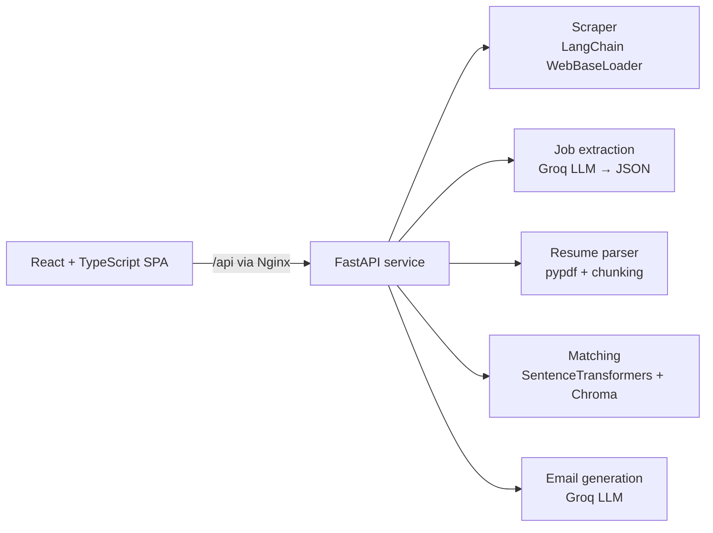

# Job Matching & Outreach

A REST API that scrapes a company's careers page, extracts job postings with an LLM, ranks them against your resume using semantic embeddings, and drafts a tailored cold email for the best match.

**Backend:** Python, FastAPI, Pydantic, LangChain, Groq (GPT-OSS 120B), SentenceTransformers, ChromaDB

**Frontend:** React, TypeScript, Vite, Tailwind CSS, Vitest, React Testing Library

**Infra:** Docker, Docker Compose, Nginx, GitHub Actions

## Architecture



The core logic lives in an installable package (`src/job_outreach`) with no web framework code in it. The API layer wires it together with FastAPI dependency injection, which also lets tests swap in a fake LLM, embedder and scraper. The React frontend is served by Nginx, which also proxies `/api` to the backend, so the browser only ever talks to one origin. Its TypeScript types are generated from the API's OpenAPI schema, and CI fails if either side drifts.

## Quick start (Docker)

```bash
cp .env.example .env        # add your GROQ_API_KEY
docker compose up --build
```

- App: http://localhost:8080
- API docs (Swagger): http://localhost:8000/docs

## Local development

```bash
# Backend
python -m venv .venv && source .venv/bin/activate
make install                # pip install -e ".[dev]"
make api                    # uvicorn with auto-reload on :8000
make test && make lint      # pytest, ruff

# Frontend (second terminal; Vite proxies /api to :8000)
make web-install            # npm ci
make web                    # http://localhost:5173
make web-test && make web-lint

# After changing any API schema, regenerate the TypeScript types
make openapi
```

## API

| Method | Endpoint | Description |
|---|---|---|
| GET | `/health` | Liveness check, version, whether the LLM key is set |
| POST | `/api/v1/jobs/extract` | JSON `{url}` → structured job postings |
| POST | `/api/v1/resume/parse` | Multipart PDF → extracted text |
| POST | `/api/v1/match` | Multipart `url`, `resume`, `top_k` → ranked jobs with similarity scores |
| POST | `/api/v1/emails` | JSON `{job, resume_text, candidate_name}` → email draft |
| POST | `/api/v1/pipeline` | Multipart `url`, `resume` → ranked jobs + email for the top match |

```bash
curl -X POST localhost:8000/api/v1/pipeline \
  -F url=https://company.com/careers \
  -F resume=@examples/sample_resume.pdf \
  -F candidate_name="Your Name"
```

Errors return a consistent body, e.g. `{"detail": "...", "error": "ScrapeError"}`, with status codes that match the cause: 415 non-PDF upload, 413 file too large, 422 unreadable resume or bad URL, 502 scrape/LLM failure, 503 LLM not configured. Every response carries an `x-request-id` header that also appears in the logs.

## Configuration

Set via environment variables or `.env`:

| Variable | Default | |
|---|---|---|
| `GROQ_API_KEY` | none | Required for extraction and email |
| `MODEL_NAME` | `openai/gpt-oss-120b` | Groq model |
| `EMBEDDING_MODEL` | `all-MiniLM-L6-v2` | SentenceTransformers model |
| `MAX_PAGE_CHARS` | `20000` | Scraped text sent to the LLM is truncated to this |
| `MAX_UPLOAD_MB` | `5` | Resume upload limit |

## Frontend

The app makes three API calls in sequence (parse resume, match, write email) and shows which step is running or failed. Choosing a different match re-drafts the email for that job using the already-parsed resume, and stale responses from earlier requests are discarded. Inputs are validated in the browser before any request is sent, and API errors are shown with the backend's message.

## Design notes

- **Resume chunking.** MiniLM truncates input at ~256 tokens, so the resume is split into overlapping chunks and each job's score is its best match against any chunk.
- **Per-request vector index.** Each request uses a throwaway Chroma collection, so jobs from different careers pages never leak into each other's results.
- **Grounded emails.** The email prompt includes the resume and is told not to invent experience.
- **Model loaded once.** The embedding model is cached per process and baked into the Docker image at build time, so the first request isn't slow.
- **Blocking work off the event loop.** Routes are sync functions, so FastAPI runs them in a threadpool.

## Limitations

The scraper fetches static HTML, so pages rendered with JavaScript (LinkedIn, Naukri, many ATS portals) return little or no text. A headless browser (e.g. Playwright) would handle those.

## Project layout

```
src/job_outreach/     core package: scraping, extraction, resume, matching, email
src/job_outreach/api/ FastAPI app, routes, dependencies
frontend/             React + TypeScript app, Nginx config and Dockerfile
tests/                API and unit tests (no network or model downloads needed)
docker/               API Dockerfile
scripts/              OpenAPI schema export
notebooks/            original prototype notebook
```
